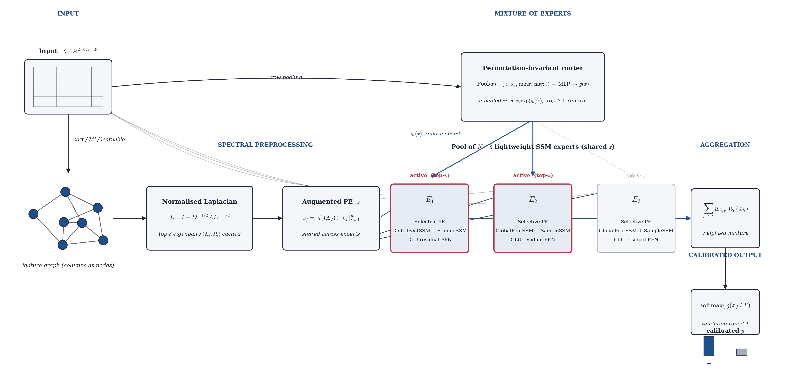

# TabularSetSSM

**A Permutation-Invariant State Space MoE with Two-Way Mixing for Tabular Data.**

This repository contains the reference implementation and the experimental
notebooks for *TabularSetSSM*, a permutation-invariant deep tabular
architecture that treats every column as a node of a data-driven feature
graph and replaces global self-attention with a factorised, Graph State
Space Convolution (GSSC) style kernel built from Laplacian-eigenvector
positional encodings. A sparse routed mixture of lightweight SSM experts is
dispatched by a permutation-invariant pooling router under a soft-to-hard
annealed temperature, and a single calibration parameter rescales the
logits for classification.



## Repository contents

```
.
├── GSSC/                                                            # Reference TabularSetSSM implementation
├── Binary_classification_dataset-high_imbalance_ratio_group1.ipynb  # Group 1 experiment notebook
├── binary_classification_dataset-binary datasets_group2.ipynb       # Group 2 experiment notebook
├── Requirements.txt                                                 # Python dependencies
├── figure1.jpg                                                      # Architecture diagram (Figure 1)
└── README.md                                                        # This file
```

## Architecture overview

The pipeline rendered in `figure1.jpg` proceeds left-to-right through six
stages.

1. **Input.** A batch tensor `X ∈ R^{B × N × F}` is interpreted with each
   of the `F` columns as a node of a feature graph and the `N` rows as
   `H`-dimensional signals living on those nodes. A learnable value
   embedding lifts every scalar entry `x_{b,n,f}` to a vector in `R^H`,
   producing an internal `[B, N, F, H]` tensor.
2. **Spectral preprocessing.** A symmetric, zero-diagonal adjacency
   `A ∈ R^{F × F}` is built once per dataset (correlation,
   mutual-information proxy, or learnable). The normalised Laplacian
   `L = I − D^{−1/2} A D^{−1/2}` is eigendecomposed once and the smallest
   `d` non-trivial eigenpairs `(Λ_d, P_d)` are stored as non-trainable
   buffers.
3. **Augmented positional encoding `z`.** Each cached eigenvector `p_f` is
   modulated by learnable spectral filters `φ_ℓ(Λ_d)` to produce
   `z_f = [φ_1(Λ_d) ⊙ p_f, …, φ_m(Λ_d) ⊙ p_f]`. The same `z` is shared
   across every expert in the pool.
4. **Mixture-of-experts.** A permutation-invariant *router* turns each row
   into expert logits via symmetric four-statistic pooling
   `(mean, std, min, max)` mapped through a small MLP. Probabilities are
   computed with a clamped softmax under a routing temperature `τ` that is
   exponentially annealed from soft to hard. Only the top-`k` experts are
   kept per row (default `k=2`) and their weights are renormalised; load
   balance and sparsity penalties discover the dataset-dependent active
   capacity `K_active` automatically. A shared pool of `K` lightweight
   SSM experts -- each a stack of `PermInvariantSSMBlock`s with halved
   hidden width, depth, and kernel rank -- consumes `z` and the row tensor.
5. **Aggregation.** With selected indices `I_b = top_k(p(x_b))` and
   re-normalised gating weights `w_{b,e}`, the routed output is
   `y(x_b) = Σ_{e ∈ I_b} w_{b,e} · Expert_e(x_b)`. Both the experts and the
   router are feature-permutation invariant, so the mixture inherits the
   same invariance.
6. **Calibrated output.** A single validation-tuned calibration
   temperature `T` rescales the logits, and `softmax(g/T)` produces the
   final classification probabilities. Training also uses a soft-F1
   auxiliary loss, alongside the routing balance and sparsity terms.

Inside each expert, **two-way set mixing** runs a feature-axis SSM
convolution across columns and a sample-axis set SSM across rows,
producing per-cell row–feature interactions without quadratic attention
and with linear-time scaling in `F` and `N`.

## `GSSC/` module guide

The reference implementation lives in `GSSC/models/`. Every file maps
directly onto a component of the diagram above.

| File | Role |
| --- | --- |
| `models/__init__.py` | Public package surface; re-exports `TabularSetSSM`, `TabularSetSSMConfig`, and the building blocks. |
| `models/feature_graph.py` | `FeatureGraphBuilder` -- constructs the symmetric, zero-diagonal feature adjacency (correlation / mutual-information proxy / learnable) and caches the top-`d` Laplacian eigenpairs as non-trainable buffers. |
| `models/positional_encoding.py` | `EigenAugmentedPE` -- builds `z_f = [φ_1(Λ_d) ⊙ p_f, …, φ_m(Λ_d) ⊙ p_f]` from the cached eigenpairs, with a shared eigenvalue-wise filter MLP. |
| `models/selective_ssm.py` | `SelectivePositionUpdate` -- the content-dependent gate that produces a data-aware `z̃_f` from `z_f` and the current row representation while preserving feature equivariance. |
| `models/global_ssm.py` | `GlobalFeatureSSM` -- the factorised global feature-axis convolution `h_f = ⟨q_f, Σ_{f'} k_{f'} ⊙ v_{f'}⟩`, implemented without ever materialising the `F × F` kernel. |
| `models/sample_ssm.py` | `SampleSetSSM` -- the mirrored row-axis factorised kernel that injects cross-sample interaction at every cell and supports optional context / query row masks (the TabPFN-style train/query boundary). |
| `models/blocks.py` | `PermInvariantSSMBlock` -- one mixing unit: selective update, global feature SSM, sample-set SSM, GLU residual FFN, and the optional low-rank feature-cross term, each with residuals and LayerNorm. |
| `models/moe.py` | `TabularSetSSMExpert` -- a lightweight expert that stacks `PermInvariantSSMBlock`s and a head; it never owns its own graph or PE and instead consumes the shared `z` from the parent. |
| `models/router.py` | `TreeRouter` -- the permutation-invariant pooling router: it forms the symmetric `(mean, std, min, max)` row pool and maps it through a two-layer MLP to per-expert logits. |
| `models/tabular_set_ssm.py` | `TabularSetSSM` and `TabularSetSSMConfig` -- the top-level model that owns the feature graph, the PE, the expert pool, and the router; it implements the soft-to-hard `τ` schedule, the top-`k` dispatch with re-normalised gating, the active-mask maintenance and `K_active` discovery, the hybrid soft-F1 training objective, validation-tuned temperature scaling, the optional train/query (`forward_with_context`) inference API, and the `fit / predict / predict_proba` interface used by the notebooks. |

Auxiliary files (`utils.py`, `train.py`, `main.py`) provide tabular
utilities, a generic training entry point, and a CLI runner; they are
imported by the experiment notebooks but are not part of the model graph.

## Experiments

The two notebooks reproduce the binary-classification experiments
reported in the paper.

- **`Binary_classification_dataset-high_imbalance_ratio_group1.ipynb` --
  Group 1.** Ten OpenML-CC18 binary tasks with `N ≤ 5,000` and an
  imbalance ratio `IR = |C_maj| / |C_min| > 4`. This notebook stress-tests
  calibration and minority-class F1 under severe class imbalance and
  reports the per-block aggregates in Table 1.1 of the paper.
- **`binary_classification_dataset-binary datasets_group2.ipynb` --
  Group 2.** Twelve AMLB binary tasks with `N ≲ 6,000` and no imbalance
  filter, covering a broader cross-section of small tabular regimes. This
  notebook reports the per-block aggregates in Table 2.1 of the paper.

Both notebooks share the same evaluation protocol: stratified `K = 5`-fold
cross-validation with shuffling, an additional `20 %` stratified validation
split carved out of each training fold to drive early stopping and the
post-hoc temperature scaling, and identical training, validation, and
test partitions across every model in a given iteration. Standard
deviations in the result tables are taken over the five shuffled folds.

Each notebook compares `TabularSetSSM` against the same five tuned
baselines used in the paper (CatBoost, XGBoost, LightGBM, TabNet, and
EBM), runs the cross-validation loop, and writes a per-dataset summary
plus the aggregated per-block table.

## Setup and reproduction

The notebooks were developed and validated against Python 3.10+ on a
single workstation with one NVIDIA GeForce RTX 5050 GPU; CPU execution
works but is considerably slower.

### 1. Clone the repository

```bash
git clone https://github.com/nips26/tabularsetssm.git
cd tabularsetssm
```

### 2. Create a clean environment and install dependencies

Create a fresh virtual environment (or conda environment) and install the
pinned dependencies from `Requirements.txt`:

```bash
python -m venv .venv
# Linux / macOS:
source .venv/bin/activate
# Windows (PowerShell):
.venv\Scripts\Activate.ps1

pip install --upgrade pip
pip install -r Requirements.txt
```

If you prefer conda:

```bash
conda create -n tabularsetssm python=3.10 -y
conda activate tabularsetssm
pip install -r Requirements.txt
```

### 3. Run the notebooks

Launch Jupyter from the same environment and open either notebook:

```bash
jupyter notebook
```

Then, in the browser, open one of:

- `Binary_classification_dataset-high_imbalance_ratio_group1.ipynb`
- `binary_classification_dataset-binary datasets_group2.ipynb`

Run the cells from top to bottom. Each notebook is self-contained: it
loads its dataset list (OpenML-CC18 for Group 1, AMLB for Group 2),
performs the stratified 5-fold cross-validation against all baselines and
`TabularSetSSM`, and prints / saves the per-block aggregated metrics
(ROC-AUC, accuracy, F1, cross-entropy, ECE, wins, and wall-clock time)
that appear in the paper.

The first execution will download the datasets via OpenML / AMLB, which
requires an active internet connection. Subsequent runs use the cached
copies on disk.


## Acknowledgement

This repository is built upon [GSSC - (What Can We Learn from State Space Models for Machine Learning on Graphs?) Huang et al., 2024](https://github.com/Graph-COM/GSSC).